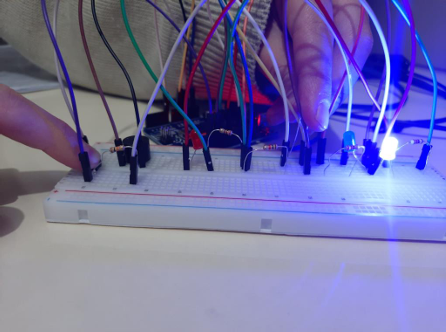

# Bitki Koruma Sistemi

Barış zambağı olarak bilinen çiçek türü belirli aralıktaki ışık şiddetlerindeinde yaşamını 
sürdürmektedir. Ben de projemde bu çiçeği baz alarak bitki koruma sistemini arduinoda 
kodlamak istedim. Zambak gerektiğinden fazla ışığa maruz kaldığında (ortamın ışık şiddeti 
100-300 arasında olduğunda) kırmızı led yanıyor ve aynı zamanda buzzer çalmaya başlıyor. 
Bu durumu kapatmak içinde butona basıldığında kırmızı led ve buzzer sönüyor.Eğer zambak 
için yeterli seviyede ışık şiddeti varsa (300-500 arasında) yeşil led yanıyor.Fakat ortamda 
çiçeğin ihtiyacından çok düşük ışık şiddeti varsa(500-sonrası) mavi led yanıyor. 
GitHub Desktop kullanarak projeyi kolayca klonlayabilir, geliştirme yapabilir ve katkıda bulunabilirsiniz.

## 🚀 Başlarken

### Projenin Görüntüsü


### 1. Bu projeyi kendi bilgisayarınıza klonlayın

GitHub Desktop kullanıyorsanız:

1. "Code" butonuna tıklayın
2. "Open with GitHub Desktop" seçeneğini seçin
3. GitHub Desktop üzerinden dizini seçin ve "Clone" butonuna tıklayın

Alternatif olarak komut satırı ile:

```bash
git clone https://github.com/elif-karakaya/Bitki-Koruma-Sistemi.git

